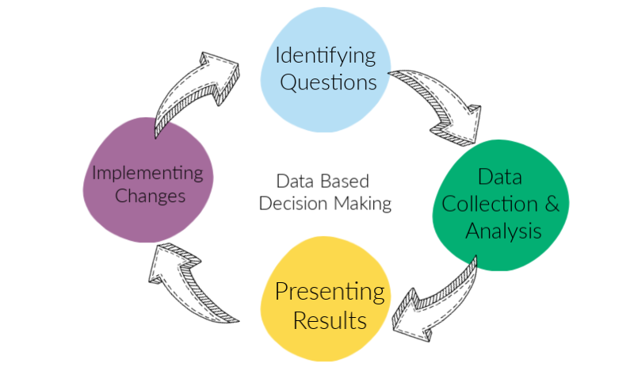

**Name:** _Marcel Damas_   
**E-Mail:** _marcel-spanien@hotmail.de_ 
  
# <u>Making business decisions based on data</u>

      
In this project this will be covered in small a way for the following...

## Project goal   

it is to filter out the important hypotheses and separate them from the less important with the help of the ICE and the RICE method. In addition, we will see an ab test to test the percentiele calculate the hypotheses and draw conclusions.  
   

## Table of contents
  
Part 1. Prioritizing Hypotheses
The file hypotheses_us.csv contains nine hypotheses on boosting an online store's revenue with Reach, Impact, Confidence, and Effort specified for each.
The task is to:

   * Apply the ICE framework to prioritize hypotheses. Sort them in descending order of priority. 
   * Apply the RICE framework to prioritize hypotheses. Sort them in descending order of priority. 
   * Show how the prioritization of hypotheses changes when you use RICE instead of ICE. Provide an explanation for the changes. 

Part 2. A/B Test Analysis
You carried out an A/B test and got the results described in the files orders_us.csv and visits_us.csv.
Task
Analyze the A/B test:

   1. Graph cumulative revenue by group. Make conclusions and conjectures.
   2. Graph cumulative average order size by group. Make conclusions and conjectures. 
   3. Graph the relative difference in cumulative average order size for group B compared with group A. Make conclusions and conjectures.
   4. Calculate each group's conversion rate as the ratio of orders to the number of visits for each day. Plot the daily conversion rates of the two groups and describe the difference. Draw conclusions and make conjectures.
   5. Plot a scatter chart of the number of orders per user. Make conclusions and conjectures.
   6. Calculate the 95th and 99th percentiles for the number of orders per user. Define the point at which a data point becomes an anomaly. 
   7. Plot a scatter chart of order prices. Make conclusions and conjectures.
   8. Calculate the 95th and 99th percentiles of order prices. Define the point at which a data point becomes an anomaly. 
   9. Find the statistical significance of the difference in conversion between the groups using the raw data. Make conclusions and conjectures. 
   10. Find the statistical significance of the difference in average order size between the groups using the raw data. Make conclusions and conjectures.
   11. Find the statistical significance of the difference in conversion between the groups using the filtered data. Make conclusions and conjectures.
   12. Find the statistical significance of the difference in average order size between the groups using the filtered data. Make conclusions and conjectures.
   13. Make a decision based on the test results. The possible decisions are: 1. Stop the test, consider one of the groups the leader. 2. Stop the test, conclude that there is no difference between the groups. 3. Continue the test.

### Link: [Complete_Project_from_Jupyter](https://github.com/marceldamas/How_to_making_business_decisions_based_on_data/blob/main/Business_decitions/Making_Business_Decisions_Based_on_Data.ipynb)   
A short summary is shown below:

First here is a look at the raw data I use to process. In this case, three different data sets were used.

The first data set was used to prioritize the hpoteses and processed using the ICE and RICE methods.
Link: [ICE/RICE](https://sudonull.com/post/11679-RICE-and-ICE-Scoring-simple-prioritization-techniques-for-advanced-product-managers)

The other two following sets of data were used for the AB test and other calculations.    
  
**Data set of orders:**  
    
  
**Data set of visits:**  
  
  
  
Below you can see a few graphics from the project who provide the answers for the following questions.  

**You carried out an A/B test and got the results described in the files orders_us.csv and visits_us.csv. Task Analyze the A/B test:    
Graph cumulative revenue by group. Make conclusions and conjectures.**  
    
  
If you put them on it looks like group A will bring less income this can have many reasons that lead to this result.  
  
    
Group B takes the lead, it looks like large orders are the cause. We need to get rid of these for our final analysis. In the complete project it is better broken down and it is examined further.  
  
**Calculate each group's conversion rate as the ratio of orders to the number of visits for each day. Plot the daily conversion rates of the two groups and describe the difference. Draw conclusions and make conjectures.**  
     
It looks as if at least every visitor is doing a tranzaction at the same time and on some days we have more transactions than visitors this can only be if we calculate id with a self-running order that no longer requires a visit and still leads to an order. The problem here at this conversion rate would be that we cannot see whether the visitors are also ordering or whether it is a self-running order.  
   
**Plot a scatter chart of the number of orders per user. Make conclusions and conjectures.**    
      
    
The graph describes the relationship between groups A and B in relation to the relationship between the orders and users. We see the number of users who have placed 0-7 orders. Group B is shown in orange and group A in blue. We also see the order and order relationship of the two groups and the number of users and the number of users of the two groups      
    
      
We see that there are a few users who place several orders but most of them make 1 order. You can roughly say that the number of orders increases with the number of users. It looks like we have more users in group B, which also makes more orders.  
  
**Plot a scatter chart of order prices. Make conclusions and conjectures.**  
   
Most prices are below 1000, there are a few outliers that are higher than that, the highest outlier has a price of 19920.4.  
  
The hypothesis tests are also listed in the full project.  
  
###  General conclusion  
  
In this project we prioritized the hypotheses with the help of the ICE and the RICE method. Then we presented and interpreted the cumulative revenue by group. We also compared and interpreted the cumulative average order by group and cumulative conversion. We compared the conversion rate of the two groups and the number of orders per user.There's a significant difference in the data between the groups, according to both the raw data. We determined the percentages 95 and 99 and with that the abnormalities. Finally we tested 4 hypoteses two with raw data and 2 with the filtered data. After the tests, we drew conclusions for each hypotesis and looked at whether they exceeded our significant level and thus make a significant difference between the groups average. After the anomalies were removed, it turned out there was a statistically significant difference between the groups average order sizes!  