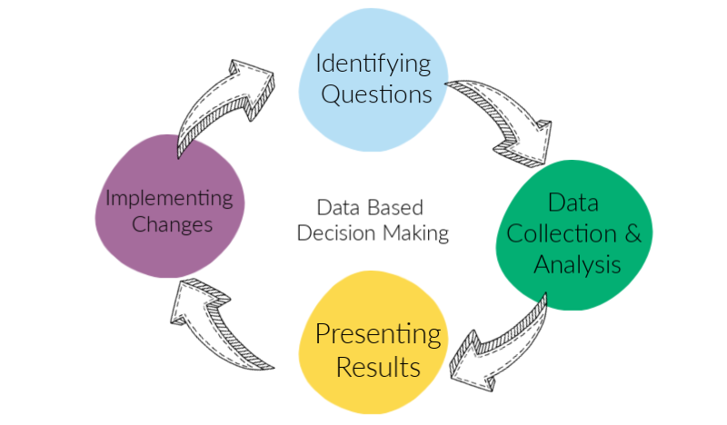

**Name:** _Marcel Damas_   
**E-Mail:** _marcel-spanien@hotmail.de_ 
  
# <u>Making business decisions based on data</u>

      
In this project this will be covered in small a way for the following...

## Project goal   

it is to filter out the important hypotheses and separate them from the less important with the help of the ICE and the RICE method. In addition, we will see an ab test to test the percentiele calculate the hypotheses and draw conclusions.  
   

## Table of contents
  
Part 1. Prioritizing Hypotheses
The file hypotheses_us.csv contains nine hypotheses on boosting an online store's revenue with Reach, Impact, Confidence, and Effort specified for each.
The task is to:

   * Apply the ICE framework to prioritize hypotheses. Sort them in descending order of priority. 
   * Apply the RICE framework to prioritize hypotheses. Sort them in descending order of priority. 
   * Show how the prioritization of hypotheses changes when you use RICE instead of ICE. Provide an explanation for the changes. 

Part 2. A/B Test Analysis
You carried out an A/B test and got the results described in the files orders_us.csv and visits_us.csv.
Task
Analyze the A/B test:

   1. Graph cumulative revenue by group. Make conclusions and conjectures.
   2. Graph cumulative average order size by group. Make conclusions and conjectures. 
   3. Graph the relative difference in cumulative average order size for group B compared with group A. Make conclusions and conjectures.
   4. Calculate each group's conversion rate as the ratio of orders to the number of visits for each day. Plot the daily conversion rates of the two groups and describe the difference. Draw conclusions and make conjectures.
   5. Plot a scatter chart of the number of orders per user. Make conclusions and conjectures.
   6. Calculate the 95th and 99th percentiles for the number of orders per user. Define the point at which a data point becomes an anomaly. 
   7. Plot a scatter chart of order prices. Make conclusions and conjectures.
   8. Calculate the 95th and 99th percentiles of order prices. Define the point at which a data point becomes an anomaly. 
   9. Find the statistical significance of the difference in conversion between the groups using the raw data. Make conclusions and conjectures. 
   10. Find the statistical significance of the difference in average order size between the groups using the raw data. Make conclusions and conjectures.
   11. Find the statistical significance of the difference in conversion between the groups using the filtered data. Make conclusions and conjectures.
   12. Find the statistical significance of the difference in average order size between the groups using the filtered data. Make conclusions and conjectures.
   13. Make a decision based on the test results. The possible decisions are: 1. Stop the test, consider one of the groups the leader. 2. Stop the test, conclude that there is no difference between the groups. 3. Continue the test.

